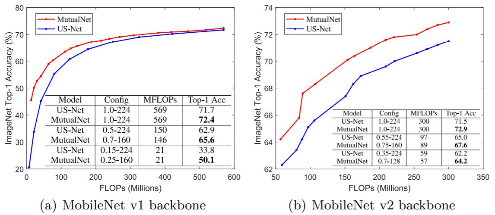

# MutualNet: Adaptive ConvNet via Mutual Learning from Network Width and Resolution (ECCV'20 Oral) [[arXiv]](https://arxiv.org/abs/1909.12978)
This work proposes a method to train a network that is executable at dynamic resource constraints (e.g., FLOPs) during runtime. The proposed mutual learning scheme for input resolution and network width significantly improves the accuracy-efficiency tradeoffs over [Slimmable Networks](https://github.com/JiahuiYu/slimmable_networks) on various tasks such as image classification, object detection and instance segmentation. The method is also promising to serve as a plug-and-play strategy to boost a single network. It substantially outperforms the powerful [AutoAugment](http://openaccess.thecvf.com/content_CVPR_2019/html/Cubuk_AutoAugment_Learning_Augmentation_Strategies_From_Data_CVPR_2019_paper.html) in both efficiency (GPU search hours: 15000 vs. 0) and accuracy (ImageNet: 77.6% vs. 78.6%).

# Install
- PyTorch 1.0.1, torchvision 0.2.2, Numpy, pyyaml 5.1.
- Follow the PyTorch [example](https://github.com/pytorch/examples/tree/master/imagenet) to prepare ImageNet dataset.
# Run
## Training
To train MobileNet v1, run the codes below
```
python train.py app:apps/mobilenet_v1.yml
```
Training hyperparameters are in the .yml files. `width_mult_list` is just used to print training logs for corresponding network widths. During testing, you can assign any desired width between the width lower bound and upper bound. To train other models, just use the corresponding .yml files.
## Testing

Modify `test_only: False` to `test_only: True` in .yml file to enable testing. 

Modify `pretrained: /PATH/TO/YOUR/WEIGHTS` to assign trained weights.

Modify `width_mult_list` to test more network widths.
```
python train.py app:apps/mobilenet_v1.yml
```
# Results and model weights
## Performance over the whole FLOPs specturm
Comparison with [US-Net](http://openaccess.thecvf.com/content_ICCV_2019/html/Yu_Universally_Slimmable_Networks_and_Improved_Training_Techniques_ICCV_2019_paper.html) under different backbones on ImageNet.

Model weights: [[MobileNet v1]](https://drive.google.com/open?id=1A36ZJCrkKXQX8T0vZR9kRN5P1fjIDMu2), [[MobileNet v2]](https://drive.google.com/open?id=1GIe5Mpbkc2CptvPbqcEgJtPSoP2WYkNm)

## Scaling up model compared with EfficienNet
The best model scaling on MobileNet v1 compared with [EfficientNet](http://proceedings.mlr.press/v97/tan19a.html)
|Model|Best Model Scaling|FLOPs|Top-1 Acc|
|-----|------------------|-----|---------|
[EfficientNet](http://proceedings.mlr.press/v97/tan19a.html)|*d=1.4, w=1.2, r=1.3*|2.3B|75.6%|
MutualNet ([Model](https://drive.google.com/open?id=1NdygihO3AxEp7f9XyhofoYz_64ki_Sma))|*w=1.6, r=1.3*|2.3B|**77.1%**|
## Boosting performance of a single network
Top-1 accuracy on Cifar-10 and Cifar-100
|WideResNet-28-10|GPU search hours|Cifar-10|Cifar-100|
|----------------|:--------------:|:------:|:-------:|
|[Baseline](https://arxiv.org/abs/1605.07146)|0|96.1%|81.2%|
|[Cutout](https://arxiv.org/abs/1708.04552)|0|96.9%|81.6%|
|[Mixup](https://arxiv.org/abs/1710.09412)|0|97.3%|82.5%|
|[AutoAugment](http://openaccess.thecvf.com/content_CVPR_2019/html/Cubuk_AutoAugment_Learning_Augmentation_Strategies_From_Data_CVPR_2019_paper.html)|5000|**97.4%**|82.9%|
|[Fast AutoAugment](http://papers.nips.cc/paper/8892-fast-autoaugment)|3.5|97.3%|82.7%|
|MutualNet|0|97.3%|**83.8%**|

Compared with state-of-the-art performance boosting methods on ImageNet
|ResNet-50|Additional Cost|Top-1 Acc|
|---------|:-------------:|:-------:|
|[Baseline](http://openaccess.thecvf.com/content_cvpr_2016/html/He_Deep_Residual_Learning_CVPR_2016_paper.html)| \ |76.5%|
|[Cutout](https://arxiv.org/abs/1708.04552)| \ |77.1%|
|[Mixup](https://arxiv.org/abs/1710.09412)| \ |77.9%|
|[CutMix](https://arxiv.org/abs/1905.04899)| \ |**78.6%**|
|[KD](https://openreview.net/forum?id=B1ae1lZRb)|Teacher Network|76.5%|
|[SENet](http://openaccess.thecvf.com/content_cvpr_2018/html/Hu_Squeeze-and-Excitation_Networks_CVPR_2018_paper.html)|SE Block|77.6%|
|[AutoAugment](http://openaccess.thecvf.com/content_CVPR_2019/html/Cubuk_AutoAugment_Learning_Augmentation_Strategies_From_Data_CVPR_2019_paper.html)|15000 GPU search hours|77.6%|
|[Fast AutoAugment](http://papers.nips.cc/paper/8892-fast-autoaugment)|450 GPU search hours|77.6%|
|MutualNet ([Model](https://drive.google.com/open?id=1Br3o58lZqyGzZaqZpqhAfUJhMawFS_Pc))| \ |**78.6%**|
# Reference
\- The code is based on the implementation of [Slimmable Networks](https://github.com/JiahuiYu/slimmable_networks).
